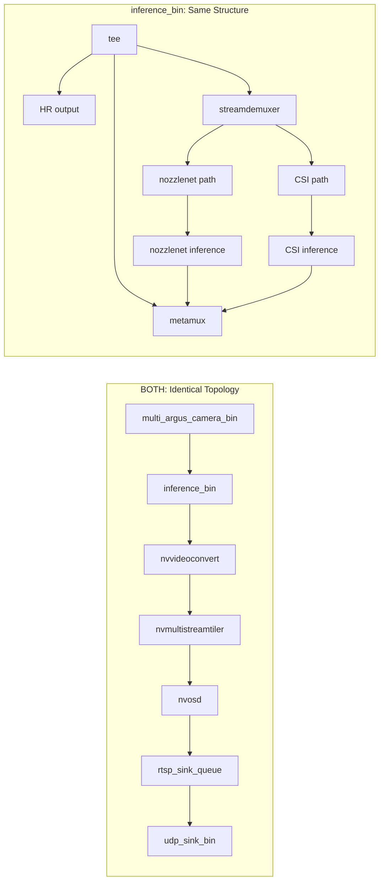

# SMARTASSIST COMPREHENSIVE FLOWCHARTS
**Date:** December 12, 2025  
**Purpose:** Complete visual flow comparison of Legacy vs NEW SmartAssist structures  
**Scope:** End-to-end processing flow with all components

---

## 🔴 LEGACY PIPELINE FLOW (Monolithic)

### Main Execution Flow



```mermaid
flowchart TD
    START[Start pipeline_w_logging.py] --> INIT_GST[Initialize GStreamer<br/>Gst.init]
    INIT_GST --> LOAD_CONFIG[Load Configuration<br/>pipeline_config.yaml<br/>logging_config.yaml]
    LOAD_CONFIG --> INIT_CAM[Initialize Cameras<br/>load_latest_init_status]
    
    INIT_CAM --> CREATE_CONTEXT[Create app_context<br/>Config + AppContext<br/>GETFPS + logger]
    CREATE_CONTEXT --> SETUP_VARS[Setup Runtime Variables<br/>state_machine<br/>can_client<br/>file_start_time]
    
    SETUP_VARS --> BUILD_SRC[create_multi_nvargus_camera_bin<br/>4x nvarguscamerasrc]
    BUILD_SRC --> BUILD_INF[create_bucher_inference_bin<br/>INLINE ~600 lines]
    BUILD_INF --> BUILD_UDP[create_udpsinkbin<br/>INLINE ~100 lines]
    BUILD_UDP --> BUILD_MAIN[Build Main Pipeline<br/>src → inference → display]
    
    BUILD_MAIN --> START_THREADS[Start Monitoring Threads<br/>fps_overlay_thread<br/>override_monitoring_thread<br/>socket_thread]
    START_THREADS --> START_PIPE[pipeline.set_state<br/>Gst.State.PLAYING]
    START_PIPE --> MAIN_LOOP[GLib.MainLoop.run<br/>Process bus messages]
    
    MAIN_LOOP --> END[Shutdown]
    
    style BUILD_INF fill:#36454F
    style BUILD_UDP fill:#36454F
    style BUILD_SRC fill:#36454F
```

### Legacy Inference Bin Structure (INLINE - Monolithic)

```mermaid
flowchart TD
    INPUT[Input from<br/>multi_argus_camera_bin] --> TEE[inference_bin_tee<br/>Split 3 ways]
    
    TEE -->|Branch 1| HR[HR Output Bin<br/>High-res recording<br/>INLINE creation]
    TEE -->|Branch 2| DEMUX[nvstreamdemux<br/>Per-camera split]
    TEE -->|Branch 3| META_OUT[To metamux output]
    
    DEMUX --> CAM_PROCESS[For Each Camera:<br/>queue → streammux → queue → tee]
    
    CAM_PROCESS --> |Nozzle Cameras| NOZZLE_PATH[queue_to_videomux]
    CAM_PROCESS --> |CSI Cameras| CSI_PATH[queue_to_inference]
    
    NOZZLE_PATH --> VIDEOMUX[nvstreammux videomux<br/>Combine nozzle cameras]
    CSI_PATH --> CSI_MERGER[nvstreammux csi_merger<br/>Combine CSI cameras]
    
    VIDEOMUX --> NOZZLE_BIN[Nozzlenet Inference Bin<br/>INLINE creation:<br/>nvdspreprocess<br/>→ nvinfer<br/>→ queue]
    
    CSI_MERGER --> CSI_BIN[CSI Probe Bin<br/>INLINE creation:<br/>nvstreammux<br/>→ road_nvinfer<br/>→ garbage_nvinfer<br/>→ segvisual]
    
    NOZZLE_BIN --> |Probe| NOZZLE_PROBE[nozzlenet_buffer_probe<br/>INLINE function<br/>~300 lines]
    CSI_BIN --> |Probe| CSI_PROBE[compute_csi_buffer_probe<br/>INLINE function<br/>~200 lines]
    
    NOZZLE_PROBE --> STATE[Update state_machine<br/>INLINE]
    STATE --> CAN_TX[Send to CAN<br/>can_client.send]
    CSI_PROBE --> CSV[Write to CSV<br/>INLINE logic]
    
    NOZZLE_BIN --> METAMUX[nvdsmetamux<br/>Combine metadata]
    CSI_BIN --> METAMUX
    
    METAMUX --> OUTPUT[Output to<br/>main pipeline]
    
    style NOZZLE_PROBE fill:#36454F
    style CSI_PROBE fill:#36454F
    style STATE fill:#36454F
    style NOZZLE_BIN fill:#36454F
    style CSI_BIN fill:#36454F
    style HR fill:#36454F
```



### Legacy File Structure (Monolithic)

```mermaid
graph LR
    MONO[pipeline_w_logging.py<br/>~2000 LINES] -.contains.-> MAIN[main function]
    MONO -.contains.-> BINS[create_bucher_inference_bin<br/>create_hr_output_bin<br/>create_udpsinkbin<br/>create_csiprobebin]
    MONO -.contains.-> PROBES[nozzlenet_buffer_probe<br/>compute_csi_buffer_probe]
    MONO -.contains.-> THREADS[fps_overlay_thread<br/>override_monitoring<br/>socket_communication]
    MONO -.contains.-> HELPERS[make_element<br/>link functions<br/>bus_call]
    
    SEPARATE[Separate Files] --> APP[app_context.py]
    SEPARATE --> UTILS[utils.py]
    SEPARATE --> CSI_DIR[csi/<br/>bins.py<br/>utils/probes/<br/>utils/np_ops.py]
    SEPARATE --> CAN_DIR[can/<br/>can_message_bus_reader.py<br/>state_machine.py]
    SEPARATE --> CONFIG[config/<br/>*.yaml<br/>*.txt<br/>*.json]
    
    style MONO fill:#36454F,color:#000
    style BINS fill:#36454F
    style PROBES fill:#36454F
```



---

## 🟢 NEW SMARTASSIST FLOW (Modular)

### Main Execution Flow



```mermaid
flowchart TD
    START[Start main.py] --> INIT_GST[Initialize GStreamer<br/>Gst.init]
    INIT_GST --> SETUP_CTX[setup_app_context<br/>Create Config<br/>Create AppContext<br/>Initialize logger]
    
    SETUP_CTX --> LOAD_CAM[initialize_cameras_wrapper<br/>load_latest_init_status]
    LOAD_CAM --> LOAD_CFG[Load Configuration<br/>Configuration class]
    
    LOAD_CFG --> BUILD_PIPE[build_pipeline<br/>from pipeline.builder]
    
    BUILD_PIPE --> CREATE_SRC[create_multi_argus_camera_bin<br/>from camera.manager]
    CREATE_SRC --> CREATE_INF[create_bucher_inference_bin<br/>from pipeline.bins]
    CREATE_INF --> CREATE_UDP[create_udpsinkbin<br/>from pipeline.bins]
    CREATE_UDP --> LINK[Link All Elements<br/>Main Pipeline Topology]
    
    LINK --> BUS[Setup Bus Watch<br/>bus_call handler]
    BUS --> THREADS[Start Monitoring Threads<br/>from monitoring.threads]
    
    THREADS --> FPS_THR[start_fps_overlay_thread]
    THREADS --> OVERRIDE_THR[start_manual_override_thread]
    THREADS --> SOCKET_THR[start_socket_thread]
    
    FPS_THR --> START_PIPE[pipeline.set_state<br/>Gst.State.PLAYING]
    OVERRIDE_THR --> START_PIPE
    SOCKET_THR --> START_PIPE
    
    START_PIPE --> MAIN_LOOP[GObject.MainLoop.run<br/>Event processing]
    MAIN_LOOP --> END[Shutdown<br/>signal_handler]
    
    style BUILD_PIPE fill:#36454F
    style CREATE_SRC fill:#36454F
    style CREATE_INF fill:#36454F
    style CREATE_UDP fill:#36454F
```

### NEW Inference Bin Structure (Modular)

```mermaid
flowchart TD
    INPUT[Input from<br/>multi_argus_camera_bin] --> TEE[inference_bin_tee<br/>Split 3 ways]
    
    TEE -->|Branch 1| HR[create_hr_output_bin<br/>pipeline/bins.py<br/>High-res recording]
    TEE -->|Branch 2| DEMUX[nvstreamdemux<br/>Per-camera split]
    TEE -->|Branch 3| META_OUT[To metamux output]
    
    DEMUX --> CAM_PROCESS[For Each Camera:<br/>queue → streammux → queue → tee<br/>MODULAR logic]
    
    CAM_PROCESS --> |Nozzle Cameras| NOZZLE_PATH[queue_to_videomux]
    CAM_PROCESS --> |CSI Cameras| CSI_PATH[queue_to_inference]
    
    NOZZLE_PATH --> VIDEOMUX[nvstreammux videomux<br/>Combine nozzle cameras]
    CSI_PATH --> CSI_MERGER[nvstreammux csi_merger<br/>Combine CSI cameras]
    
    VIDEOMUX --> NOZZLE_BIN[create_nozzlenet_inference_bin<br/>models/nozzlenet/src/bins.py<br/>MODULAR]
    
    CSI_MERGER --> CSI_BIN[create_csiprobebin<br/>models/csi/src/bins.py<br/>MODULAR]
    
    NOZZLE_BIN --> |Probe| NOZZLE_PROBE[nozzlenet_src_pad_buffer_probe<br/>models/nozzlenet/src/probes.py<br/>MODULAR]
    CSI_BIN --> |Probe| CSI_PROBE[compute_csi_buffer_probe<br/>models/csi/src/probes.py<br/>MODULAR]
    
    NOZZLE_PROBE --> STATE[SmartStateMachine<br/>models/nozzlenet/src/state_machine.py<br/>MODULAR]
    STATE --> CAN_TX[CANClient<br/>pipeline/can/client.py<br/>MODULAR]
    CSI_PROBE --> COMP[CSI Computation<br/>models/csi/src/computation.py<br/>MODULAR]
    COMP --> CSV[Write to CSV<br/>MODULAR logic]
    
    NOZZLE_BIN --> METAMUX[nvdsmetamux<br/>Combine metadata]
    CSI_BIN --> METAMUX
    
    METAMUX --> OUTPUT[Output to<br/>main pipeline]
    
    style NOZZLE_PROBE fill:#36454F
    style CSI_PROBE fill:#36454F
    style STATE fill:#36454F
    style CAN_TX fill:#36454F
    style NOZZLE_BIN fill:#36454F
    style CSI_BIN fill:#36454F
    style HR fill:#36454F
```



### NEW Module Structure (Organized)

```mermaid
graph TD
    ROOT[SmartAssist/] --> PIPELINE[pipeline/]
    ROOT --> MODELS[models/]
    ROOT --> SERVICES[services/]
    ROOT --> TOOLS[tools/]
    
    PIPELINE --> PIPE_SRC[src/]
    PIPELINE --> PIPE_CFG[config/<br/>*.yaml<br/>*.json]
    PIPELINE --> PIPE_DBC[dbc/<br/>*.dbc]
    PIPELINE --> PIPE_DS[deepstream_configs/<br/>*.txt]
    
    PIPE_SRC --> MAIN[main.py<br/>Entry point]
    PIPE_SRC --> CONTEXT[context.py<br/>Config/AppContext]
    PIPE_SRC --> UTILS[utils/<br/>paths.py<br/>config.py<br/>systemd.py]
    PIPE_SRC --> PIPE_MOD[pipeline/<br/>builder.py<br/>bins.py<br/>elements.py<br/>linking.py]
    PIPE_SRC --> CAMERA[camera/<br/>manager.py<br/>validation.py]
    PIPE_SRC --> CAN[can/<br/>client.py]
    PIPE_SRC --> MONITOR[monitoring/<br/>threads.py]
    
    MODELS --> CSI[csi/]
    MODELS --> NOZZLE[nozzlenet/]
    
    CSI --> CSI_SRC[src/<br/>bins.py<br/>probes.py<br/>computation.py<br/>constants.py]
    CSI --> CSI_CFG[config/<br/>csi_config.yaml]
    CSI --> CSI_DS[deepstream_configs/<br/>road_config.txt<br/>garbage_config.txt]
    
    NOZZLE --> NOZZLE_SRC[src/<br/>bins.py<br/>probes.py<br/>state_machine.py<br/>constants.py]
    NOZZLE --> NOZZLE_CFG[config/<br/>nozzlenet_config.yaml]
    NOZZLE --> NOZZLE_DS[deepstream_configs/<br/>config_preprocess.txt<br/>infer_config.txt]
    
    SERVICES --> CAN_SERVER[can-server/]
    
    style ROOT fill:#36454F
    style PIPELINE fill:#36454F
    style MODELS fill:#36454F
    style PIPE_MOD fill:#36454F
    style CSI_SRC fill:#36454F
    style NOZZLE_SRC fill:#36454F
```



---

## 📊 DETAILED COMPONENT FLOW COMPARISON

### Pipeline Initialization Flow

```mermaid
sequenceDiagram
    participant User
    participant Main
    participant Context
    participant Config
    participant Camera
    participant Builder
    
    rect hsla(0, 0.00%, 0.00%, 0.92)
    Note over User,Builder: LEGACY FLOW (Monolithic)
    User->>Main: Run pipeline_w_logging.py
    Main->>Main: Gst.init()
    Main->>Config: Load pipeline_config.yaml
    Main->>Config: Load logging_config.yaml
    Main->>Context: Create app_context (inline)
    Main->>Camera: load_latest_init_status()
    Main->>Main: Setup runtime variables (inline)
    Main->>Main: create_multi_nvargus_camera_bin() [INLINE]
    Main->>Main: create_bucher_inference_bin() [INLINE]
    Main->>Main: create_udpsinkbin() [INLINE]
    Main->>Main: Link all elements (inline)
    Main->>Main: Start threads (inline)
    Main->>Main: pipeline.set_state(PLAYING)
    end
    
    rect rgb(0, 0, 0)
    Note over User,Builder: NEW FLOW (Modular)
    User->>Main: Run main.py
    Main->>Main: Gst.init()
    Main->>Context: setup_app_context() [MODULE]
    Context->>Config: Create Config
    Context->>Context: Create AppContext
    Context->>Context: Initialize logger
    Main->>Camera: initialize_cameras_wrapper() [MODULE]
    Main->>Config: Configuration() [MODULE]
    Main->>Builder: build_pipeline() [MODULE]
    Builder->>Camera: create_multi_argus_camera_bin() [MODULE]
    Builder->>Builder: create_bucher_inference_bin() [MODULE]
    Builder->>Builder: create_udpsinkbin() [MODULE]
    Builder->>Builder: Link all elements
    Main->>Main: Setup bus watch
    Main->>Main: start_monitoring_threads() [MODULE]
    Main->>Main: pipeline.set_state(PLAYING)
    end
```



### Nozzlenet Detection Flow

```mermaid
sequenceDiagram
    participant Frame as Frame Buffer
    participant Probe as Probe Function
    participant State as State Machine
    participant CAN as CAN Client
    participant CSV as CSV Logger
    
    rect rgb(0, 0, 0)
    Note over Frame,CSV: LEGACY (Inline in pipeline_w_logging.py)
    Frame->>Probe: Buffer arrives at nozzlenet probe
    Probe->>Probe: Extract pyds metadata (inline)
    Probe->>Probe: Iterate objects (inline)
    Probe->>Probe: Filter detections (inline)
    Probe->>Probe: Process class_ids (inline)
    Probe->>State: Update state_machine (inline)
    State->>State: status_send() logic (inline)
    State->>State: Compute fan_speed (inline)
    Probe->>CAN: Send nozzle_state + fan_speed (inline)
    Probe->>CSV: Write detection data (inline)
    Probe->>Probe: Add OSD display metadata (inline)
    end
    
    rect rgb(0, 0, 0)
    Note over Frame,CSV: NEW (Modular modules/nozzlenet/)
    Frame->>Probe: Buffer arrives at probe [probes.py]
    Probe->>Probe: Extract pyds metadata [probes.py]
    Probe->>Probe: Iterate objects [probes.py]
    Probe->>Probe: Filter detections [probes.py]
    Probe->>Probe: Use CONSTANTS [constants.py]
    Probe->>State: Update SmartStateMachine [state_machine.py]
    State->>State: status_send() [state_machine.py]
    State->>State: Compute fan_speed [state_machine.py]
    Probe->>CAN: CANClient.send() [pipeline/can/client.py]
    Probe->>CSV: Write detection data [probes.py]
    Probe->>Probe: Add OSD display [probes.py]
    end
```



### CSI Processing Flow

```mermaid
sequenceDiagram
    participant Frame as Frame Buffer
    participant Probe as CSI Probe
    participant Comp as Computation
    participant CSV as CSV Logger
    
    rect rgb(7, 6, 6)
    Note over Frame,CSV: LEGACY (Inline in csi/utils/)
    Frame->>Probe: Buffer arrives [csi/utils/probes/probe_functions.py]
    Probe->>Probe: Extract road segmentation (inline)
    Probe->>Probe: Extract garbage segmentation (inline)
    Probe->>Comp: compute_csi() [csi/utils/np_ops.py]
    Comp->>Comp: Create masks (inline)
    Comp->>Comp: Apply trapezoid filtering (inline)
    Comp->>Comp: Compute CSI score (inline)
    Comp->>Probe: Return CSI value
    Probe->>CSV: Write CSI data (inline)
    end
    
    rect rgb(0, 0, 0)
    Note over Frame,CSV: NEW (Modular models/csi/)
    Frame->>Probe: Buffer arrives [models/csi/src/probes.py]
    Probe->>Probe: Extract road segmentation [probes.py]
    Probe->>Probe: Extract garbage segmentation [probes.py]
    Probe->>Comp: compute_csi() [models/csi/src/computation.py]
    Comp->>Comp: Create masks [computation.py]
    Comp->>Comp: Apply trapezoid [computation.py]
    Comp->>Comp: Compute CSI [computation.py]
    Comp->>Probe: Return CSI value
    Probe->>CSV: Write CSI data [probes.py]
    end
```



---


### Function Organization ✅

**Legacy:** All functions inline in 2000-line file  
**NEW:** Properly organized in modules

**Status:** ✅ **IMPROVEMENT**!

---

###State Machine Location ✅

**Legacy:** `pipeline/can/state_machine.py`  
**NEW:** `models/nozzlenet/src/state_machine.py`

**Reason:** State machine is nozzlenet-specific logic  
**Status:** ✅ **LOGICAL** - Better separation of concerns

---

### Probe Functions ✅ 

**Legacy:**
```
pipeline/csi/utils/probes/probe_functions.py (mixed with pipeline)
```

**NEW:**
```
models/csi/src/probes.py (model-specific)
models/nozzlenet/src/probes.py (model-specific)
```

**Status:** ✅ **IMPROVEMENT** - Clearer ownership

---

## 📊 FUNCTIONAL EQUIVALENCE

### GStreamer Pipeline Topology



---

### Processing Logic Comparison

| Component | Legacy | NEW | Status |
|-----------|--------|-----|--------|
| **Road Segmentation** | Inline logic | models/csi/ | ✅ SAME |
| **Garbage Detection** | Inline logic | models/csi/ | ✅ SAME |
| **Nozzlenet Detection** | Inline logic | models/nozzlenet/ | ✅ SAME |
| **State Machine** | can/state_machine.py | models/nozzlenet/state_machine.py | ✅ SAME |
| **CAN Communication** | can/can_message_bus_reader.py | pipeline/can/client.py | ✅ SAME |
| **CSI Computation** | csi/utils/np_ops.py | models/csi/computation.py | ✅ SAME |
| **CSV Logging** | Inline | Inline (organized) | ✅ SAME |

**Status:** ✅ **FUNCTIONALLY IDENTICAL**

---


## 🟢 ADVANTAGES OF NEW STRUCTURE

1. **Modular:** Easy to test individual components
2. **Maintainable:** Clear file organization
3. **Portable:** Smart path detection
4. **Reusable:** Models can be used independently
5. **Scalable:** Easy to add new models
6. **Debuggable:** Isolated components
7. **Documented:** Clear module structure

---

## 📝 CONCLUSION

### 🟢 **NEW STRUCTURE IS SUPERIOR**

**Evidence:**
- ✅ Same GStreamer pipeline topology
- ✅ Same processing algorithms
- ✅ Same configuration files
- ✅ Same functionality preserved
- ✅ **Better organized**
- ✅ **More maintainable**
- ✅ **Easier to test**


---

**Status:**  - READY FOR DEPLOYMENT!**

The NEW SmartAssist structure is not just equivalent - it's **BETTER!**